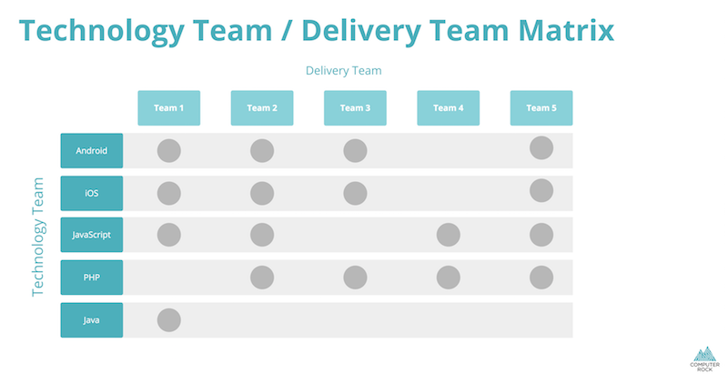

# JavaScript Technology Team Guide

## Welcome to JavaScript team!

This guide will help you quickly settle down and familiarize yourself with all the procedures and technologies that are 
being used in our team.

### About

JavaScript Technology team is responsible for development and publishing cross-platform applications using 
JavaScript and related technologies within Computer Rock. 

### Technology Team organization

The JavaScript Technology team consists of numerous JavaScript developers and is led by technology team leader, Ivan D. Stanković.

Technology team leader is responsible for maintaining the discipline, work ethics, quality, exploring technical solutions, 
estimating projects and also helping resolve any issues members of the team might have.

In JavaScript team we strive for technical excellence, high quality code and constant innovation in solving problems. We 
achieve this by maintaining best technical practices and development principles. Together, we define and follow processes 
for all phases of the project development. We organize and share knowledge accumulated during the work on projects.

### Delivery team organization

Delivery team is the team responsible for one or more projects. Delivery team typically consists of several developers 
from different technology teams, designers, project managers and technical project managers. Delivery team is led by 
delivery team manager, responsible for overseeing the projects and making sure that deliverables are created properly, 
in time and with quality in mind.


### Developer roles & responsibilities

As a member of JavaScript team you will be assigned in certain developer role to delivery team. Your exact role on project 
will be determined based on knowledge, experience and tasks need to be done. 

Depending on focus of the role (UI/design, application development, operations, etc..), responsibilities may include all 
or some from the list: 

* delivering high quality, maintainable and well-tested code
* following team coding standards and processes
* planning, estimating and implementing application features  for given platform
* being able to prioritize and finish multiple tasks on project
* implementing user interface from provided mockups & designs
* ensuring UI meets given requirements (browsers, resolutions, input methods) 
* developing application business layer and integrating it with UI
* fixing defects and maintaining existing products 
* evaluating and implementing advanced JavaScript libraries, building our own
* optimizing applications for maximum speed and scalability
* creating application setup, build and deployment process for given environments and platforms


### Meeting schedule

As JavaScript and Delivery team member you will attend several types of meetings:

**Delivery team meetings**, 15-60’, daily/weekly - depending on delivery team, project managers and agile process used, 
meetings can include daily stand ups, sprint planning, sprint reviews, retrospectives, etc..

**JavaScript team meeting**, 40’, every 2-3 weeks - team activities planning & discussion meeting. Here we address current 
technology and project challenges, share achievements and knowledge, plan research and innovation, plan Web-tech 
presentations and Rock IT meetups.

**Web-tech presentation**, 60’, monthly - Organized together / in same time slot with Web back-end team. Presentation and 
discussion on given technological topic. Attendance not mandatory.  

**One-on-One meeting**, 30’, every 5 weeks - Meeting with technology team leader for two directional feedback and addressing 
topics not appropriate for office or other meetings. During employee’s 3 month trial period this meeting will be held 
every 2 weeks.


## Software development environment

### Software

As IDE of choice, most team members use Webstorm/Phpstorm (IntelliJ) for which Computer Rock provides license. You may 
use any other IDE as long it is set up to output code that respects coding style guides and standards used in team.

You will also need to install all needed software and set system environment for development. Depending on your team 
role you may need some or all from the list: Slack, Skype, LastPass, different browsers (Chrome, Firefox, Internet 
Explorer) and extensions for them (React/Redux Devtools, Livereload), NVM, Node.js, Homebrew, iTerm, Postman, Charles, 
virtualization platforms for testing (VirtualBox, Vagrant, ansible), Sketch, Photoshop, Xcode, Android Studio.

Detailed environment setup steps are documented in team’s processes guide located at 
[spoiledmilk.beanstalkapp.com/javascript-team-toolbox](https://spoiledmilk.beanstalkapp.com/javascript-team-toolbox)

## Online services & tools

Beside software on your workstation, you will have access to several online services and tools we use to organize processes, 
document and track progress on projects:

* **Google G Suite** - Gmail, Calendar, Drive, Docs, Sheets, Slides and Forms
* **Blueprint** ([blueprint.computerrock.com](https://blueprint.computerrock.com)) - project time tracking tool
* **Redmine** ([redmine.computerrock.com](https://redmine.computerrock.com)) - project and issue tracking tool
* **Basecamp** ([computerrock.basecamphq.com](https://computerrock.basecamphq.com)) - project documentation
* **Beanstalkapp** ([spoiledmilk.beanstalkapp.com](https://spoiledmilk.beanstalkapp.com)) - git/svn development platform
* **Browserstack** ([browserstack.com](https://browserstack.com)) - live browser testing
* **HockeyApp** ([hockeyapp.net](https://hockeyapp.net)) - app development and distribution platform

Delivery team and/or client may have additional online services you will use while working on projects: Jira, Confluence, 
GitHub, GitLab, etc..


## Projects

### Documentation

All project documentation that is not directly related to code, is kept and maintained in *Basecamp*. This may include: 

* documentation for features, requirements and solutions,
* back-end services information,
* third party services documentation,
* deployment environments listing and setup information.

Credentials for any services used will be stored and shared in LastPass. Ask your team leader and/or project manager for 
enabling access to any resource you are missing when joining project.

Code related resources will be on *Beanstalkapp* platform. After cloning project repository, always first check README.md 
file located in root of project. It will contain basic project information, prerequisites installation, setup and build 
steps. 

### Technology stack overview

Main technology stack we use in team is: React, Redux, Sass/SCSS, built and transpilled with Webpack and Babel. We also 
use application level libraries: redux-saga, redux-thunk, moment.js, Immutable.js

Older projects may use more legacy stack based on: React, Flux, built and transpilled with Gulp, Browserify and Babel. 

Detailed project setup steps and contribution rules are in team’s processes guide located at 
[spoiledmilk.beanstalkapp.com/javascript-team-toolbox](https://spoiledmilk.beanstalkapp.com/javascript-team-toolbox)


### Coding standards & processes

For JavaScript we use variation of Crockford/AirBnB style guide checked and validated with eslint. 

For Sass/SCSS we use BEM methodology and variation of [Brad Frost’s CSS architecture for design systems](http://bradfrost.com/blog/post/css-architecture-for-design-systems), 
checked and validated with stylelint. 

For detailed coding style rules check team’s processes guides located at 
[spoiledmilk.beanstalkapp.com/javascript-team-toolbox](https://spoiledmilk.beanstalkapp.com/javascript-team-toolbox)
