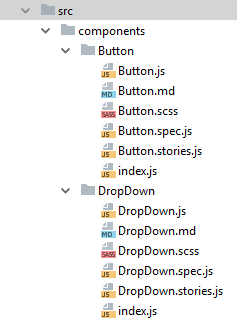

# Sass/SCSS Project Architecture

This document defines architecture for styles (Sass/SCSS) used on JavaScript application projects. Methodology described 
augments the Component-based UI approach we use with React and closely follows principles of Atomic Design. 

We established conventions and syntax on these principles:

* **Modularity** - There is a clear separation between components. We should be able to pull out component's style files
 and apply them to other project with least effort possible 

* **Legibility, Clarity & Scalability** - Code should be understandable at glance. Intention and purpose behind each 
selector should be clear from name. We sacrifice shorter class names in exchange for scalability and re-usability.

* **Flat selectors** - Long selectors should be avoided wherever possible in order to keep CSS independent from DOM.

* **No conflicts** - In order to have truly re-usable components, class names should not conflict with other libraries
 and systems.


## Class usage and naming

We use class names only, no tag names or ids. To name classes we use BEM methodology together with global namespace 
definition and category prefix. Here is an example:

```scss
.cn-c-header__logo--large {}
```

Let's analyze each part of class name in detail.

#### Global namespace

All classes should be prefixed with a global namespace, which is abbreviation of client's company name (in examples 
`Client Name`) or `Computer Rock` followed by hyphen:

```
.cn-
.cr-
```

For truly re-usable (between projects) and on-every-project stuff we use `.cr-` prefix. For all other, client project 
specific code we use abbreviation of client's company name. Abbreviation should be 4 characters maximum in order to keep 
things short. Examples: Vubiquity `.vub-`, Daimler Smart `.ds-`, Red Bull `.rb-`, etc.

#### Class category prefix

Each class should be also prefixed with category explaining what job it is doing. Prefixes are:

* `c-` for UI components, examples: `.cn-c-card`, `cn-c-header`
* `u-` for utility classes, example: `.cn-u-margin-bottom-double` 
* `is-`, `are-`, `has-` for component level utility state classes. Preferably class should be prefixed with `.cr-` 
namespace and not client name prefix, as they will also exist in some re-usable component UI package. Examples: `.cr-is-active`,
`.cr-is-disabled`, etc.
* `l-` for layout-related styles. If possible, don't use them. New CSS Grid specification, together with Flexbox, implies 
handling of layout without the need for specialized classes.
* `js-` for targeting JavaScript-specific functionality (think of old jQuery type scripts). We use React, so in most cases 
you will also not need this type of prefix. So avoid it. 

### BEM syntax

Remainder of the class name follows BEM syntax rules. BEM stands for "Block Element Modifier", which means:

* **Block** is the primary component block, such as `.cn-c-card` or `.cr-c-button`. It encapsulates a standalone entity
that is meaningful on its own. While blocks can be nested and interact with each other, semantically they remain equal; 
there is no precedence or hierarchy.

* **Element** is a child of the primary block, such as `.cn-c-card__title`. Elements are parts of a block and have no 
standalone meaning. Any element is semantically tied to its block.

* **Modifier** is a variation of a component style, such as `.cn-c-alert--error`. Modifiers are flags on blocks or elements.
Use them to change appearance or behaviour. 

For block, element and modifier names we always use *kebab-case*. We prefer to use full nouns instead of abbreviations. 
You can read more about [BEM methodology](http://getbem.com/) on official documentation page. 


## Usage of parent selector

Use of Sass/SCSS [parent selector mechanism](http://thesassway.com/intermediate/referencing-parent-selectors-using-ampersand) 
is limited to BEM modifiers, built in states, and utility state classes. We don't use it for BEM elements. Example:

```scss
.cn-c-tile {
    &--special {}
    &:hover {}   
    &.cr-is-disabled {}
}

.cn-c-tile__image {
    &--special {}
    &:hover {}   
    &.cr-is-disabled {}
}
```

Parent selector should also be used to maintain all css rules for given component in one location/file. Example:

```scss
.cn-c-primary-navigation {
    // ...some base rules
    
    // Navigation appearing as nested element in header component
    .cn-c-header & {
        margin-left: auto;
    }
}
```


## Nesting rules

Nesting in Sass can be very convenient, but runs the risk of poor output with overly long selector strings. We follow the 
[Inception Rule](http://thesassway.com/beginner/the-inception-rule) and never nest more than **three layers deep**.

We also limit nesting to the following use cases: 

* **Modifiers of a style block**, should be nested inside parent block or element. Example: 

```scss
.cn-c-alert {
    border: 1px solid gray;
    color: gray;
    
    &--error {
        border-color: red;
        color: red;
    }
}
```

* **Media queries**, specific for component should not be nested at the end of file, but inside the component 
block. This improves legibility. Example:

```scss
.cn-c-primary-navigation {
     // ...base styles here   

    @media all and (min-width: 40em) {
        display: flex;
    }
    
    // some modifier 
    &--special {
        // ...
    }
    
    @media all and (min-width: 40em) {
        &--special {
            // ...more special
        }
    }
}
```
 
* **States**, of the component should be included as a nested component. This includes both built in state and utility 
 state classes. Example: 

```scss
.cr-c-button { 
    background: gray;
    
    &:hover,
    &:focus {
        background: blue;
    }
    
    &.cr-is-active {
        background: darkblue;
    }
}
```

* **Parent selectors**, as demonstrated in all previous examples.


## File naming and folder structure

All CSS rules for component should live inside one file. File should be named as React component. For example styles for 
`Button.js` React component are inside `Button.scss` file and are placed near component in folder structure. Block part 
of class name should match React component class name and filename, where *CamelCase* is replaced with *kebab-case* (example:
`DropDown.scss` contains block class named `.cn-c-drop-down`).  



Figure 1: [Component folder structure](./images/component-folder-structure.png)

Non-component files containing: variables, mixins, functions, and global styling (eg. `mixins.scss`, `reset.scss`, 
`index.scss`) should be named using *kebab-case* style. We never use Sass partials naming with leading `_`.


## Comment blocks and documentation

Unlike for JavaScript where we use [JSDoc](http://usejsdoc.org/) for the styles there is no consensus nor widely 
adopted standard and set of tools for in-code documentation. This is why we don't try to use any kind of opinionated 
format or style for documentation blocks. We use simple `/* ... */` blocks and inline comments `// ...` which are provided
by Sass. Also, we don't create large comment headers at the beginning of file. Example:

```scss
@import '../styles/config';

/* Header component */
.vub-c-header {
    align-items: center; // inline comments are allowed
}

/*
    Header component
    
    documentation block can be multiline if there is a need
    for more information 
*/
.vub-c-header {
    // code section comment
    margin: 0 auto;
}
```

Styles change and go, and without consensus and tool support (IDE, node.js, ..) there is no point in manually 
maintaining them. We try to keep things simple and according to allowed CSS and Sass/SCSS syntax until standard is established.


## Sources and inspiration

Sass/SCSS project architecture is inspired by these sources:

* [Brad Frost’s CSS architecture for design systems](http://bradfrost.com/blog/post/css-architecture-for-design-systems)
* [BEM methodology](http://getbem.com/)
* [Atomic Web Design](http://www.atomicdesign.bradfrost.com/)
* [Component-based software engineering](https://en.wikipedia.org/wiki/Component-based_software_engineering)
* [Web Components](https://en.wikipedia.org/wiki/Web_Components)
